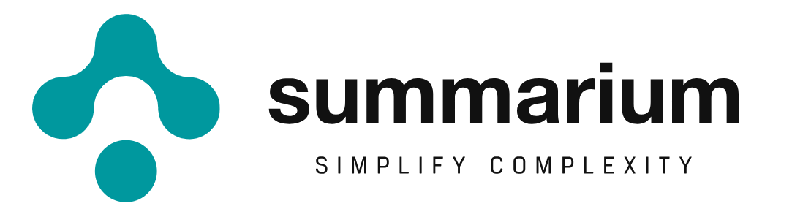

#  Summarium

**Summarium** is a cutting-edge consultancy tool that combines the power of **generative large language models (LLMs)** and robust **Python-based data analysis**. Designed for professionals seeking actionable insights, Summarium enables goal-driven analysis of datasets, providing comprehensive reports based on the user’s specific requirements.

---

## Overview

Summarium bridges the gap between sophisticated data analysis and user accessibility. The tool operates within a controlled Python virtual environment, leveraging libraries like `pandas`, `numpy`, and `scipy` to perform exploratory data analysis (EDA), statistical modeling, and optimization. The analysis process uses **retroactive thinking**: LLMs iteratively refine results based on real-time feedback, ensuring thorough and reliable insights.

This project was developed during the **IAthon 2025 Tecnun Hackathon** by Team **K-Means Knights**.

### Team Members
- GUI & FrontEnd team:
  - Celia Noguerol Puente
  - Nerea Gorrotxategi Vergara
- File Conversion and Prompt engineering team
  - Ander Ardanaz
  - Scarlete Romero Tipan
- Data Analisys engine and Gateways team 
  - Alberto Colmenero Fernández

---

## Key Features

### 🔬 Advanced Analytical Framework
- Accepts **CSV datasets** and automatically performs analysis based on user-defined goals.
- Operates a up a **Python virtual environment** with pre-installed libraries such as:
  - `pandas` for data manipulation.
  - `scipy` for advanced statistical computations.
  - etc...

### 🔄 Retroactive Thinking
- The core of our algoritm consists on an **iterative execution model** where the LLM:
  1. Generates Python code based on the dataset and user prompt.
  2. Executes the code in a controlled environment.
  3. Refines its approach using the output or errors generated.
- Analysis concludes only when a comprehensive understanding is achieved, goals are met and the LLM has enough information to confidently provide advice on how to achieve the goals prompted

### 📄 Comprehensive Reporting
- Generates Reports in markdown or HTML format with:
  - Statistical insights.
  - Predictive models.
  - Optimization strategies.

### 🌐 User-Friendly Web Interface
- Built using **Streamlit**, the GUI ensures an intuitive experience for users of all technical levels.

---

## Core Implementation Details

The heart of Summarium lies in its **`GptAnalysisEnv`** class, designed for seamless integration of generative AI and Python-based data analysis. Key components include:

### Dataset Handling
- Automatic parsing of CSV files with flexible data type inference.
- Supports mixed data types and ensures robust error handling during dataset loading.

### Analysis Workflow
- Initializes an LLM-driven **conversation context**, with a clear role delineation:
  - LLM operates as a "data analyst," generating Python code for analysis.
  - Python acts as the execution environment, returning real-time outputs to the LLM.
- Ensures iterative refinement using:
  - Error detection and handling.
  - Contextual responses based on standard output.

### Modular Environment
- Enables controlled execution using libraries like `pandas`, `numpy`, and `scipy` without external imports.
- Prevents unauthorized code execution with a custom code parsing mechanism.

## Installation
```bash
git clone https://github.com/colmenasio/IAthon25_Knigths
cd IAthon25_Knigths
python -m venv .venv
source .venv/activate.sh
pip install -r dependencies.txt
```
>>> pandoc and wkhtmltopdf must also be installed for filetype conversion purposes
>>> a chatgpt API key must be provided in a json file in `IAthon25_Knigths/config/api_keys.json`, under the `openai_key` key

```bash
sudo apt install pandoc
sudo apt install wkhtmltopdf
```

To run the web app:
```bash
cd IAthon25_Knigths
streamlit run src/main.py
```


